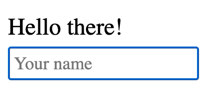

# Hello

[Realar](https://github.com/betula/realar) shared state demonstration.

[](./src/app.js)

```javascript
import React from "react";
import { unit, useShared } from "realar";

const Hello = unit({
  name: "",             // Immutable state
  setName(name) {
    this.name = name;   // Update immutable state
  }
});

const Header = () => {
  const { name } = useShared(Hello);
  return (
    <header>
      Hello {name || "there"}!
    </header>
  )
};

const Main = () => {
  const { name, setName } = useShared(Hello);
  return (
    <main>
      <input
        placeholder="Your name"
        value={name}
        onChange={(ev) => setName(ev.target.value)} />
    </main>
  )
};

export const App = () => (
  <>
    <Header />
    <Main />
  </>
);
```

Try It on your computer :blush:

```bash
git clone git@github.com:realar-project/hello.git
cd hello
npm i
npm run start
# Open http://localhost:1234 in your browser
```

Enjoy!
