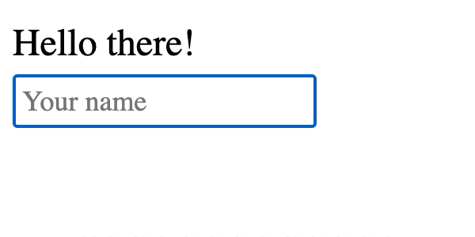

# Hello

[Realar](https://github.com/betula/realar) shared state demonstration.



```bash
git clone git@github.com:realar-project/hello.git
cd hello
npm i
npm run start
# Open http://localhost:1234 in your browser
```

Enjoy!
